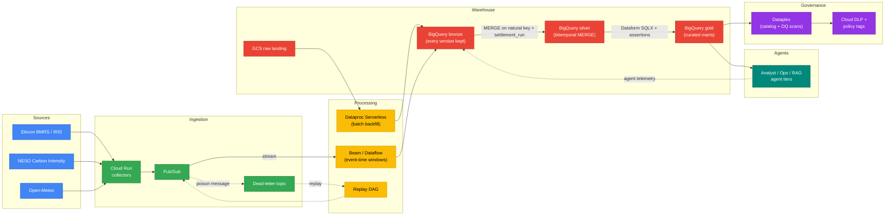

# ⚡ GridPulse

## ⚡ Quick Summary

GB electricity settlement periods don't settle once — they get republished
through reconciliation runs for up to four months after the event, and each
run can move the imbalance price. Most portfolio data projects sidestep this
entirely: pull a CSV snapshot, load it once, done. GridPulse treats the
republishing itself as the interesting engineering problem. `event_time`,
`published_at`, and `settlement_run` are modeled as separate first-class
dimensions all the way from ingestion to the gold layer — nothing is
overwritten, current-state is a view over history, and any past belief state
is reconstructable with an as-of query.

The second design constraint is the exam-alignment angle: every objective in
the Google Cloud Professional Data Engineer exam guide v4.2 gets a runnable
artifact somewhere in this repo, not a bullet point in a notes file. The
platform runs entirely on free-tier and local emulators by default, with
real GCP reserved for short, budget-capped demo windows — so the whole thing
is buildable and rebuildable without a standing cloud bill.

> *A GCP data platform that treats "the numbers changed after publication"
> as the interesting problem, not an edge case to paper over.*

---

## 🏷️ Project Badges

[](https://cloud.google.com/)
[](https://cloud.google.com/bigquery)
[](https://cloud.google.com/dataflow)
[](https://beam.apache.org/)
[](https://cloud.google.com/pubsub)
[](https://cloud.google.com/dataform)
[](https://cloud.google.com/dataplex)
[](https://cloud.google.com/biglake)
[](https://cloud.google.com/vertex-ai)
[](https://www.terraform.io/)
[](https://www.docker.com/)
[](https://airflow.apache.org/)
[](https://www.python.org/)
[](https://fastapi.tiangolo.com/)
[](https://github.com/features/actions)
[](https://cloud.google.com/certification/data-engineer)
[](#-known-limitations--roadmap)

---

## 📌 Project Overview

- **Bitemporal by design** — every settlement figure keeps `event_time`,
  `published_at`, and `settlement_run` as separate dimensions; nothing is
  overwritten, current-state is a view, any past belief state is
  reconstructable via as-of queries.
- **Runs on a laptop** — every managed GCP service has a local emulator
  twin under `docker compose`; the same Terraform and pipeline code target
  both runtimes. Real GCP is used only in short, budget-capped demo windows.
- **All open data, zero paid APIs** — Elexon BMRS/IRIS, NESO Carbon
  Intensity, Open-Meteo, EIA, ENTSO-E, and the London smart-meter dataset;
  no market-data subscriptions, no scraping.
- **Exam-guide-complete** — every sub-objective in the Google Cloud PDE
  exam guide v4.2 maps to a specific file in this repo; see
  `docs/exam-guide-map.md`.
- **Governance grounded in a real privacy risk** — household smart-meter
  load curves are genuinely re-identifiable; DLP profiling, policy tags,
  and k-anonymity thresholds defend that risk, not a checkbox.
- **Agents that watch their own platform** — the ops agent tier streams
  its own token/latency/outcome telemetry back into the same medallion
  pipeline it operates on.

---

## ⚙️ Tech Stack

| Layer | Tool | Purpose |
|---|---|---|
| Ingestion | Cloud Run, Elexon IRIS/BMRS REST | Push + poll collectors, versioned bronze contract |
| Messaging | Pub/Sub (+ emulator) | Decoupled ingestion, DLQ for poison messages |
| Stream processing | Apache Beam (DirectRunner / Dataflow) | Event-time windowing keyed on settlement period |
| Batch processing | Apache Spark (Docker / Dataproc Serverless) | Bulk historical reprocessing |
| Object storage | MinIO (local) / Google Cloud Storage | Raw landing, lifecycle-tiered |
| Lakehouse | Apache Iceberg on MinIO / BigLake | Open table format over object storage |
| Warehouse | BigQuery (sandbox / on-demand) | Bronze/silver/gold medallion marts |
| Transformation | Dataform SQLX | Reviewed, tested silver→gold transforms |
| Governance | Dataplex, Cloud DLP, policy tags | Catalog, DQ scans, PII masking |
| ML | BigQuery ML, embeddings + vector index | Demand forecast, spike classifier, RAG |
| Agents | ADK, Agent Engine, Conversational Analytics API | Analyst/ops/eval agent tiers |
| Orchestration | Cloud Composer / Airflow (docker-compose) | DAG scheduling, retries, backfill |
| IaC | Terraform 1.6+ | Every resource, local-twin and cloud parameterised |
| Serving | FastAPI on Cloud Run | Gold-mart API |
| CI/CD | GitHub Actions | Lint, unit tests, `terraform validate`, Dataform compile |

---

## 🎯 Business Problem

> GB electricity imbalance prices are settled, then re-settled, then
> re-settled again — up to four months after the event. A forecast or a
> cost report built on any single version of that data is quietly wrong
> the moment the next reconciliation run publishes. How much does that
> drift cost, and how do you build a warehouse that tells the truth about
> what it believed at every point in time, not just what it believes now?

---

## 🎓 PDE Exam Alignment

| § | Section | Weight | Coverage |
|---|---|---|---|
| 1 | Designing data processing systems | ~22% | IAM least-privilege SAs in Terraform, CMEK, DLP-led PII strategy, dev/prod separation, DR runbook, restatement idempotency as explicit ACID decision, migration planning (Datastream, DMS, BQ DTS) |
| 2 | Ingesting and processing the data | ~25% | Pub/Sub + DLQ + replay, Beam windowing with tuned lateness, Dataproc Serverless, AI data enrichment inside the pipeline, Composer + Workflows, CI/CD |
| 3 | Storing the data | ~20% | Partitioning/clustering benchmarked, BigLake over Iceberg, Bigtable-vs-BigQuery ADR, GCS lifecycle tiering, Dataplex zones/federated governance |
| 4 | Preparing and using data | ~15% | Materialized views + BI Engine, policy-tag masking + DLP, BigQuery ML, embeddings + vector index for RAG, Analytics Hub |
| 5 | Maintaining and automating | ~18% | BigQuery Editions/reservations vs on-demand, Airflow DAGs with retries/backfill, `INFORMATION_SCHEMA` cost dashboards, Cloud Monitoring alert policies, multi-region failover drill |

Topics most pre-2024 study material misses, covered deliberately here:

- AI data enrichment as an **ingestion** concern, not a bolt-on afterthought
- Prompting LLMs for query generation, framed as a reliability problem
- Unstructured data prep for **embeddings/RAG**, not just structured ELT
- **Dataplex Catalog** (the current product), not the deprecated Data Catalog
- **BigQuery Editions/reservations** (current pricing model), not flat-rate slots
- **BigLake** as a distinct storage choice, not a footnote under BigQuery

---

## 🏗️ Architecture



Restatement in practice — one settlement period, four publications:

```
Settlement Period 2026-08-14 18:00-18:30, imbalance price:

  T+0    run II   82.4    initial estimate
  T+1d   run SF   79.1    interim settlement  <- event-time window long closed
  T+1m   run R1   80.6    reconciliation 1
  T+4m   run R2   80.9    reconciliation 2 (final for most purposes)
```

Key decisions this architecture rests on:

| Decision | Choice | Why |
|---|---|---|
| Overwrite vs. append vs. bitemporal | Bitemporal | Only model that keeps every version *and* answers "what did we believe on date X" — see [ADR 0001](docs/adr/0001-bitemporal-restatement-model.md) |
| Bigtable vs. BigQuery for hot lookups | BigQuery (with a documented Bigtable comparison) | Query patterns are analytical, not single-row-latency-bound — see [ADR 0002](docs/adr/0002-bigtable-vs-bigquery-hot-lookups.md) |
| Masking approach for household data | DLP profiling + policy tags + k-anonymity thresholds | Load curves are re-identifiable; the risk is real, not theoretical — see [ADR 0003](docs/adr/0003-masking-policy-household-data.md) |

---

## 🧱 Core Layers

1. **Ingestion** — Cloud Run sinks and pollers write against a versioned
   bronze contract, with backoff, retry, and dead-letter handling built in
   from the first collector, not bolted on later.
2. **Processing** — Apache Beam windows events by settlement period in
   event time, with allowed lateness tuned to *measured* publication lag
   rather than a guessed constant; the dead-letter queue and replay DAG
   mean nothing is ever silently dropped. Dataproc Serverless handles bulk
   historical reprocessing.
3. **Warehouse** — Bronze retains every version of every record. Silver
   applies a bitemporal MERGE keyed on natural key plus settlement run.
   Gold marts are partitioned by settlement date and clustered by BMU or
   fuel type, with every transform written and reviewed as Dataform SQLX.
4. **Governance** — Dataplex zones and data-quality scans, Cloud DLP
   profiling, and policy-tag masking sit in front of anything shared
   through Analytics Hub.
5. **Analytics/ML** — An ARIMA_PLUS demand forecast is benchmarked against
   the published day-ahead forecast baseline — beating or losing to it is
   reported honestly either way. A boosted-tree classifier flags imbalance
   spikes, k-means clusters household load shapes, and an embedding index
   sits over market notices for retrieval.
6. **Agents** — Three tiers (analyst, ops, observability) read from and
   write telemetry back into the same medallion pipeline the rest of the
   platform runs on; the design rationale lives in internal planning
   notes, not included in this repo.

---

## 📁 Repository Structure

```
gridpulse-gcp/
├── README.md                  ← you are here
├── PROJECT-STATUS.md          ← ecosystem-wide status snapshot
├── workflow_status.md         ← in-repo placeholder; authoritative copy in auto-memory
├── Makefile                   ← up/down/seed/pipeline/test-*/cloud-* targets
├── docker-compose.yml         ← local emulator stack (Pub/Sub, Bigtable, Postgres, MinIO, Spark, Airflow…)
├── .env.example                ← placeholder config, no real identifiers
├── CLAUDE.md                  ← project-level agent guardrails, extends the global config
├── docs/                       ← exam-guide map, ADRs, data-source + cost docs
│   ├── exam-guide-map.md      ← every v4.2 sub-objective → file → status
│   ├── exam-guide-delta.md    ← tracks changes to the published exam guide
│   ├── data-sources.md        ← source, licence, cadence, attribution per feed
│   ├── cost-model.md          ← what each cloud demo window actually costs
│   └── adr/                   ← architecture decision records
│       ├── 0001-bitemporal-restatement-model.md
│       ├── 0002-bigtable-vs-bigquery-hot-lookups.md
│       └── 0003-masking-policy-household-data.md
├── infra/                      ← Terraform IaC + IAM baseline, local-twin + cloud parameterised
│   ├── terraform/              ← IaC, one module per service, local-twin + cloud parameterised
│   └── iam/                    ← least-privilege service-account definitions
├── ingest/                      ← Cloud Run collectors, bronze contracts, CDC
│   ├── collectors/              ← Cloud Run push/poll collectors
│   ├── contracts/                ← versioned bronze schema contracts
│   └── cdc/                      ← Datastream/Debezium change-data-capture config
├── transform/                   ← Beam windowing, Dataform SQLX marts, Spark backfill
│   ├── beam/                    ← event-time windowing pipeline
│   ├── dataform/                ← silver/gold SQLX transforms + assertions
│   └── spark/                   ← batch backfill jobs
├── govern/                       ← Dataplex zones/DQ scans, DLP profiling, policy-tag masking
│   ├── dataplex/                ← zones, catalog config, DQ scans
│   ├── dlp/                     ← PII profiling jobs
│   └── policy_tags/              ← column-level masking policies
├── ml/                            ← BQML forecasting/classification, embeddings + vector index
│   ├── forecasting/              ← BQML ARIMA_PLUS demand forecast
│   ├── classification/           ← boosted-tree imbalance-spike classifier
│   └── embeddings/                ← vector index over market notices
├── agents/                        ← Analyst/Ops/RAG agent tiers + eval harness
│   ├── analyst/                  ← Conversational Analytics API tier
│   ├── ops/                      ← Restatement Sentinel, DQ Steward, Market Context agents
│   ├── rag/                       ← retrieval layer over embeddings
│   └── eval/                      ← golden-question CI eval harness
├── serving/                        ← FastAPI gold-mart API + Cloud Run deployment config
│   ├── fastapi/                  ← gold-mart API
│   └── cloud_run/                ← deployment config
├── orchestrate/                     ← Airflow/Composer DAGs, Cloud Workflows
│   ├── dags/                       ← Airflow/Composer DAGs
│   └── workflows/                  ← Cloud Workflows definitions
├── ops/                              ← Monitoring, DR runbook, Editions/reservations cost study
│   ├── monitoring/                 ← alert policies, dashboards
│   ├── dr/                          ← disaster-recovery runbook
│   └── cost/                        ← Editions/reservations study
└── tests/                            ← unit, data-quality/contract, and integration tests
    ├── unit/                        ← pipeline logic unit tests
    ├── data/                         ← data-quality/contract tests
    └── integration/                  ← end-to-end emulator-backed tests
```

Every directory gets its own `README.md` stating its purpose and which exam
objectives it serves. Empty directories carry a `.gitkeep`. **Phase 0 status:
the directory scaffolding, per-directory READMEs, config (Terraform
skeleton, docker-compose, Makefile, CI), and docs shown in the tree above
all exist and are tracked — but no pipeline code has been written yet.**
The tree is the target shape now filled in structurally; the logic inside
it is what later phases add. See
[Known Limitations & Roadmap](#-known-limitations--roadmap).

---

## 🗂️ Module Backlog

| Module | Directory | Exam Objective(s) |
|---|---|---|
| IAM & security baseline | `infra/iam/` | §1.1 |
| Multi-env Terraform | `infra/terraform/` | §1.1, §1.3 |
| DR runbook | `ops/dr/` | §1.2, §5.5 |
| Bitemporal restatement engine | `transform/beam/` | §1.2, §2.2 |
| Data migration plan (Datastream/DMS) | `infra/terraform/modules/datastream/` | §1.4 |
| Cloud Run collectors (IRIS + REST pollers) | `ingest/collectors/` | §2.1, §2.2 |
| Pub/Sub DLQ + replay DAG | `ingest/contracts/`, `orchestrate/dags/` | §2.2, §2.3 |
| Beam windowing pipeline | `transform/beam/` | §2.2 |
| Dataproc Serverless backfill | `transform/spark/` | §2.2, §5.1 |
| Composer/Workflows orchestration | `orchestrate/dags/`, `orchestrate/workflows/` | §2.3, §5.2 |
| CI/CD pipeline | `.github/workflows/` | §2.3 |
| BigLake/Iceberg lakehouse | `transform/spark/`, `infra/terraform/modules/biglake/` | §3.1, §3.3 |
| Bitemporal silver/gold Dataform marts | `transform/dataform/` | §3.2, §3.4 |
| Dataplex zones & DQ scans | `govern/dataplex/` | §3.4, §5.4 |
| DLP + policy-tag masking | `govern/dlp/`, `govern/policy_tags/` | §4.1, §1.1 |
| BQML forecasting & classification | `ml/forecasting/`, `ml/classification/` | §4.2 |
| Embeddings + vector-search RAG | `ml/embeddings/`, `agents/rag/` | §4.2 |
| Analytics Hub sharing | `serving/` | §4.3 |
| BigQuery Editions/reservations study | `ops/cost/` | §5.3 |
| Monitoring & alerting | `ops/monitoring/` | §5.4 |
| Agent tiers (Analyst/Ops) + eval harness | `agents/analyst/`, `agents/ops/`, `agents/eval/` | §2.2, §4.2 |

---

## ▶️ How to Run

**Phase 0 has no runnable pipeline yet.** `make up` is implemented today —
it runs `docker compose up -d` and brings up real local emulator
containers. `make seed` and `make pipeline` are still Phase 1 stubs — this
section documents the target interface so it's visible from day one, not
retrofitted later.

> **Caveat:** `make up` starts all 8 emulator containers, but `airflow`
> and `debezium` won't reach a fully healthy/functional state until
> Phase 1 wiring lands — Airflow needs its DB migration + admin user +
> webserver entrypoint command, and Debezium's Kafka broker doesn't exist
> in this compose file yet (its `BOOTSTRAP_SERVERS` is a placeholder). The
> other 6 services (Pub/Sub, Bigtable, Spanner, Postgres, MinIO, Spark)
> come up clean.

### 📌 Local (target — no GCP account needed)

```bash
# 1. Clone the repository
git clone https://github.com/deepan-mehta-analytics/gridpulse-gcp.git
cd gridpulse-gcp

# 2. Copy the environment template and fill in local values
cp .env.example .env

# 3. Start the local emulator stack (Pub/Sub, Bigtable, Postgres, MinIO, Spark, Airflow)
make up

# 4. Seed sample/synthetic data into the emulators
make seed

# 5. Run the pipeline end-to-end against local emulators
make pipeline

# 6. Run the unit test suite
make test-unit
```

### ☁️ Cloud demo window (target — explicitly budget-gated)

```bash
# Refuses to run without a configured budget alert — see docs/cost-model.md
make cloud-up

# Runs the same pipeline against real GCP services, short window only
make cloud-demo

# Tears everything down and returns spend to zero
make cloud-down
```

---

## 🧪 Tests

**Phase 0 — no tests exist yet; this section documents the interface tests
will be added against.** Tracked in [Roadmap](#-known-limitations--roadmap).

| Target | Will cover |
|---|---|
| `make test-unit` | Pipeline transform logic in isolation (windowing, MERGE keys, masking rules) |
| `make test-data` | Data-quality assertions — schema, null thresholds, referential checks |
| `make test-contract` | Bronze ingestion contract compliance across all collectors |
| `make test-integration` | End-to-end runs against the local emulator stack |
| `make test-agents` | Golden-question CI eval set — SQL correctness, retrieval precision, out-of-scope refusal |

---

## 📊 Results / Performance

Phase 0 has nothing measured yet. Metrics that will land here as later
phases complete:

- Restatement drift — how far T+0 estimates move by T+4m reconciliation
- Forecast MAPE vs. the published day-ahead forecast baseline
- Bytes scanned before/after partitioning and clustering tuning
- End-to-end throughput and latency (ingest → gold mart)
- Agent eval pass rate on the golden-question CI set

No numbers are reported until they're real. See Roadmap below.

---

## ⚠️ Known Limitations & 🔜 Roadmap

### Known Limitations

- **Dataplex and Datastream have no local emulator twin** — both modules
  are evidenced by Terraform plus a recorded walkthrough, never exercised
  end-to-end locally.
- **ENTSO-E token not yet requested** (registration has a ~3 business-day
  lead time) — EU sources are out of scope until it lands.
- **No pipeline code exists yet** — Phase 0 shipped the directory
  scaffolding, config (Terraform skeleton, docker-compose, Makefile, CI),
  and docs listed in the [Repository Structure](#-repository-structure)
  above; the pipeline logic those directories are meant to hold is what
  later phases add.
- **Conversational Analytics API is preview-era** — its pricing must be
  re-verified before any demo window enables it.

### Roadmap

- `Phase 0` — Scaffolding (this README, ADRs, exam-guide map, Terraform
  skeleton, CI skeleton, docker-compose skeleton) — **current phase**
- `Phase 1` — Stream ingest → bronze/silver on local emulators
- `Phase 2` — Bitemporal restatement engine + reconciliation test suite
- `Phase 3` — Batch backfill, BigLake/Iceberg, SCD2 dims, gold marts
- `Phase 4` — Governance: Dataplex, DLP, policy tags, Analytics Hub
- `Phase 5` — BQML forecasting/classification, embeddings + vector index
- `Phase 6` — Agent tiers + eval harness
- `Phase 7` — Cloud demo window: Composer, Dataflow, Dataproc, reservations study, recorded walkthrough

---

## 📂 Dataset

| Source | Content | Access | Licence |
|---|---|---|---|
| Elexon Insights (BMRS) | GB generation, demand, imbalance prices, half-hourly, incl. settlement runs | Public REST, no key | BMRS Data Licence — attribution required |
| Elexon IRIS | Near-real-time push of the same datasets | Free, account registration | as above |
| NESO Carbon Intensity API | GB carbon intensity, actual + forecast | Public REST, no key | Open |
| Open-Meteo | Weather actuals + forecast | Public REST, no key | Free non-commercial |
| EIA API v2 | US hourly demand/interchange by balancing authority | Free key, instant | US Gov open data |
| ENTSO-E Transparency | EU load, generation, prices | Free token, email `transparency@entsoe.eu`, ~3 business days | ENTSO-E terms |
| OSUKED Power Station Dictionary | BMU ↔ plant ↔ owner mapping | GitHub, open | MIT |
| London smart-meter dataset | Half-hourly consumption, ~5,500 households | London Datastore, open | Dataset-specific |
| Elexon circulars/market notices | Unstructured operational text | Public | Attribution required |

> Contains BMRS data © Elexon Limited, copyright and database right.

**Synthetic data — exactly one place:** a small operational Postgres schema
(fleet/asset/maintenance reference data) exists solely to exercise CDC/PII
patterns. It is labelled as synthetic everywhere it appears, including here
— it is not derived from or representative of any real fleet or asset data.

---

## 📚 Study Guide

`docs/exam-guide-map.md` is the master index from exam sub-objective to file
path to status. Use it to study by building, not by reading notes — every
row marked `⏳ Pending` is a specific thing in this repo to go implement,
not a topic to re-read.

---

## 💬 Feedback

Found a gap, a bug, or a place the exam-alignment claim doesn't hold up?
Open an issue on this repo's [GitHub Issues](https://github.com/deepan-mehta-analytics/gridpulse-gcp/issues)
page — suggestions and corrections are welcome.

---

## 📜 License

Released under the [MIT License](LICENSE) — Copyright (c) 2026
deepan-mehta-analytics.

---

## 👤 Author

**Deepan Mehta**

- **Data Analytics → Data Engineering → AI/ML Engineering** — GridPulse is
  the current focus: a GCP-native data platform built to cover the Google
  Cloud Professional Data Engineer exam guide v4.2 end-to-end with runnable
  artifacts, not notes.
- **Prior background** in ETL pipelines, predictive modelling, and
  analytical databases — the analytics grounding this platform's warehouse
  and marts design builds on.
- Other portfolio work spans applied ML systems and end-to-end data
  pipelines; see the repos linked below.

🔗 GitHub: [deepan-mehta-analytics](https://github.com/deepan-mehta-analytics)
🔗 Other portfolio repos: [sales-data-pipeline](https://github.com/deepan-mehta-analytics/sales-data-pipeline) · [bike-demand-ml-system](https://github.com/deepan-mehta-analytics/bike-demand-ml-system)
