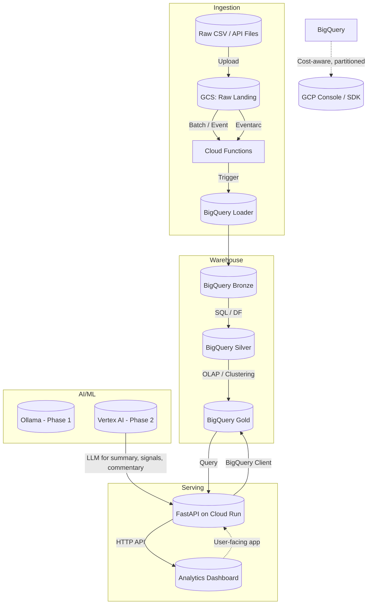

# 📦 Data-Engineering
Cloud‑ready data engineering portfolio: BigQuery, GCS, Cloud Run, Vertex AI, and PDE‑aligned projects.

[](https://cloud.google.com/)
[](https://cloud.google.com/bigquery)
[](https://cloud.google.com/vertex-ai)
[](https://cloud.google.com/run)
[](https://www.python.org/)
[](https://www.terraform.io/)
[](https://fastapi.tiangolo.com/)
[](https://cloud.google.com/learn/certification/data-engineer)


A cloud‑ready **financial data engineering platform** that ingests market data into **Google Cloud Storage (GCS)**, transforms it into analytics‑ready **BigQuery** tables, and exposes curated datasets for dashboards and AI‑assisted financial analysis. This repo is designed as a **PDE‑aligned portfolio** for BigQuery, orchestration, cost‑aware design, and ML extension via Vertex AI.

---

## ✨ Key Features

- **End‑to‑end pipeline design**  
  `GCS` → `BigQuery` → `FastAPI` (Cloud Run) → `Vertex AI`  
- **Production‑grade architecture**  
  Partitioned, clustered tables, event‑triggered ingestion, IAM‑aware deployment.  
- **PDE‑style coverage**  
  BigQuery, Dataflow, orchestration, CI/CD, IAM, cost‑aware design, monitoring hooks.  

---

## 📌 PDE Exam Alignment

This repo is structured so each project directly maps to **Google Professional Data Engineer (PDE)** exam topics:

- **BigQuery technical architecture**  
- **Data ingestion** (GCS, streaming, API pull)  
- **Data processing** (SQL, Dataflow, stored procedures)  
- **Pipeline orchestration** (Cloud Functions, Eventarc, Scheduler)  
- **Security & access control** (IAM, service accounts)  
- **CI/CD & IaC**  
- **Reliability, availability, and scalability**  
- **Cost optimization** (partitioning, clustering, materialized views)  
- **Operationalization of ML models** (Vertex AI)  

---

## 🏗️ System Architecture



### 📂 Core Layers

1. **Data pipeline layer**  
   - Stock data ingestion from CSV/API, validation, cleaning, normalization, and feature generation (e.g., moving averages, volatility, returns).  
   - Data quality rules, deduplication, schema evolution handling.  

2. **Warehouse layer**  
   - GCS raw staging.  
   - BigQuery tables partitioned by `date`, clustered by `ticker` or `exchange`.  
   - Cost‑aware SQL patterns (partition pruning, clustering, views, materialized views).  

3. **Serving layer**  
   - FastAPI endpoints on **Cloud Run** exposing analytics‑ready tables to dashboards.  
   - REST‑style APIs: `/quotes/`, `/indicators/`, `/summary/`.  

4. **Orchestration & automation**  
   - GCS upload → Cloud Functions → BigQuery load / transform.  
   - Optional scheduled jobs (Cloud Scheduler / Dataflow).  

5. **AI/ML extension**  
   - Phase 1: Local **Ollama** (Qwen2.5) for experimental explanations, commentary.  
   - Phase 2: **Vertex AI** for production‑grade summarization, forecasting experiments, or RAG‑style market commentary.  

---

## 🗂️ Repo Structure

```text
financial-data-engineering-pipeline/
├── README.md
├── architecture/
│   ├── system-design.png
│   └── data-flow.mmd
├── infra/
│   ├── terraform/
│   │   ├── main.tf
│   │   ├── variables.tf
│   │   └── outputs.tf
│   └── iam/
│       ├── roles.tf
│       └── service_accounts.tf
├── ingestion/
│   ├── api_pull/
│   │   ├── fetch_stocks.py
│   │   └── fetch_options.py
│   ├── gcs_load/
│   │   ├── upload_to_gcs.py
│   │   └── archive_gcs.py
│   └── validation/
│       ├── validate_schema.py
│       └── quality_checks.py
├── transformations/
│   ├── sql/
│   │   ├── bronze_to_silver.sql
│   │   ├── silver_to_gold.sql
│   │   └── feature_engineering.sql
│   ├── python/
│   │   ├── etl.py
│   │   └── dataflow_beam.py
│   └── indicators/
│       ├── moving_averages.py
│       └── volatility.py
├── warehouse/
│   ├── schemas/
│   │   ├── schema_bronze.json
│   │   ├── schema_silver.json
│   │   └── schema_gold.json
│   ├── partitioning_clustering/
│   │   ├── partitions.md
│   │   └── clustering.md
│   └── sample_queries/
│       ├── pde_query_cost_optimization.md
│       └── examples.sql
├── serving/
│   ├── fastapi/
│   │   ├── main.py
│   │   ├── models.py
│   │   └── routes/
│   │       ├── stocks.py
│   │       └── indicators.py
│   └── cloud_run/
│       ├── Dockerfile
│       └── cloud-run.yaml
├── orchestration/
│   ├── cloud_functions/
│   │   ├── bq_loader.py
│   │   └── bq_transformer.py
│   ├── eventarc/
│   │   └── trigger_gcs_to_bq.yaml
│   └── schedules/
│       ├── scheduled_queries.md
│       └── scheduler.yaml
├── ai_ml/
│   ├── ollama_local/
│   │   ├── ollama_client.py
│   │   └── prompt_templates.md
│   └── vertex_ai/
│       ├── llm_processor.py
│       └── model_registry.md
├── tests/
│   ├── unit_tests.py
│   └── integration_tests.py
└── docs/
    ├── pde_study_guide.md
    └── cost_analysis.md
```

---

## 📚 Google PDE‑Aligned Project List

Use this list as **backlog** and **exam‑mapping**. Each project corresponds to at least one PDE topic.

1. **BigQuery Table Design & Partitioning**
   - Create bronze/raw tables partitioned by `ingest_date`.  
   - Create silver/curated tables partitioned by `business_date` and clustered by `ticker`.  
   - Document cost‑savings vs unpartitioned baseline.  
   - Maps to: **BigQuery technical architecture, cost optimization**.

2. **Bulk Ingestion from GCS to BigQuery**
   - Upload CSV/API files to GCS, then load into BigQuery via `bq load`, scheduled SQL, or Dataflow.  
   - Implement schema evolution policy (when to add columns vs new tables).  
   - Maps to: **Data ingestion, schema design, pipeline reliability**.

3. **Incremental Event‑Triggered Loading**
   - On GCS upload event, Cloud Functions calls a BigQuery load or transformation job.  
   - Add idempotent design and error‑replay patterns.  
   - Maps to: **Data ingestion, event‑based orchestration, pipeline reliability**.

4. **SQL‑Only ETL: Bronze → Silver → Gold**
   - Use scheduled BigQuery scripts to transform raw tables into analytics‑ready tables.  
   - Add checks, rollbacks, and data quality tests.  
   - Maps to: **Data transformation, cost‑aware SQL, data quality**.

5. **Dataflow Pipeline (Python)**
   - Rewrite one SQL ETL as a Beam/Python Dataflow pipeline.  
   - Show scaling on large datasets and streaming vs batch thoughts.  
   - Maps to: **Batch & streaming processing, pipeline design**.

6. **FastAPI on Cloud Run**
   - Deploy a FastAPI service that queries BigQuery and exposes REST endpoints.  
   - Use service‑account auth, connection pooling, and time‑out resilience.  
   - Maps to: **Architecture design, serving patterns, HTTP APIs**.

7. **IAM & Service Accounts**
   - Define minimal‑privilege roles for:  
     - GCS reader,  
     - BigQuery data editor,  
     - Cloud Run secrets reader,  
     - Cloud Functions invoker.  
   - Save as Terraform + IAM documentation.  
   - Maps to: **Security & access control, IAM, policy**.

8. **CI/CD with GitHub Actions**
   - Build Docker images, run tests, deploy FastAPI to Cloud Run, deploy pipelines to GCP.  
   - Use `.github/workflows` and environment variables.  
   - Maps to: **CI/CD, IaC, DevOps**.

9. **Monitoring & Observability Hooks**
   - Add logging, basic metrics (e.g., ingestion throughput), and alerting hooks (Cloud Logging, Error Reporting).  
   - Document how to monitor pipeline health.  
   - Maps to: **Reliability, availability, scalability**.

10. **Vertex AI Experimentation Layer**
    - Use Vertex AI LLM or custom models for:  
      - summarization of market moves,  
      - commentary on anomalous price/volume,  
      - forecasting experiments.  
    - Log prompts, results, and latency.  
    - Maps to: **Operationalization of ML models, model registry patterns**.

---

## 🚀 Quick Start

1. **Prerequisites**
   - Google Cloud project with billing enabled.  
   - `gcloud` CLI, `bq` CLI, and `kubectl` installed.  
   - Python 3.10+ and `pip` / `venv`.

2. **Environment setup**

```bash
export PROJECT_ID="your-gcp-project-id"
export REGION="asia-south1"
export GCS_BUCKET="your-gcs-bucket"

# Enable required APIs
gcloud services enable \
  storage.googleapis.com \
  bigquery.googleapis.com \
  cloudfunctions.googleapis.com \
  run.googleapis.com \
  eventarc.googleapis.com \
  iam.googleapis.com
```

3. **Deploy the data pipeline**

```bash
cd infra/terraform
terraform init
terraform apply
```

4. **Ingest sample data**

```bash
cd ingestion/api_pull
python fetch_stocks.py --ticker "AAPL" --days 30
python upload_to_gcs.py --source "data/*.csv" --bucket "$GCS_BUCKET"
```

5. **Run transformations**

```bash
cd transformations/sql
bq query --project_id="$PROJECT_ID" --use_legacy_sql=false < bronze_to_silver.sql
bq query --project_id="$PROJECT_ID" --use_legacy_sql=false < silver_to_gold.sql
```

6. **Deploy FastAPI on Cloud Run**

```bash
cd serving/cloud_run
gcloud run deploy financial-dashboard-api \
  --source . \
  --project "$PROJECT_ID" \
  --region "$REGION" \
  --allow-unauthenticated \
  --service-account "your-fastapi-sa@your-project.iam.gserviceaccount.com"
```

7. **Test API**

```bash
curl https://financial-dashboard-api-<region>.run.app/stocks/AAPL/last
```

---

## 📚 PDE Study Guide (High‑Level)

- **BigQuery**  
  - Partitioning, clustering, materialized views, performance tuning, cost control.  
- **Data ingestion**  
  - GCS, BigQuery streaming vs batch, audit logs, idempotent loads.  
- **Data processing**  
  - SQL, Dataflow, complex transformations, windowing, stateful logic.  
- **Orchestration**  
  - Cloud Functions, Eventarc, Cloud Scheduler, error handling.  
- **Security**  
  - IAM roles, service accounts, encryption, KMS, secret management.  
- **CI/CD & IaC**  
  - Terraform, GitHub Actions, Deployment Manager (if you use it).  
- **Reliability**  
  - Monitoring, retries, dead‑letter topics, alerting, scaling.  
- **Cost & performance**  
  - Right‑sizing, caching, avoiding scans, partition pruning.  
- **ML**  
  - Vertex AI, model registry, batch vs online prediction, data quality for ML.

---

## 🤝 Contributing & Feedback

Contributions and improvements are welcome. Please open an issue or PR with:
- Better queries or partitioning strategies.  
- Additional PDE‑aligned example projects.  
- New metrics or monitoring patterns.  

---

## 📄 License

MIT License – see `LICENSE` in the root.
